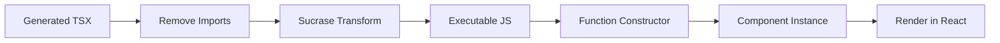
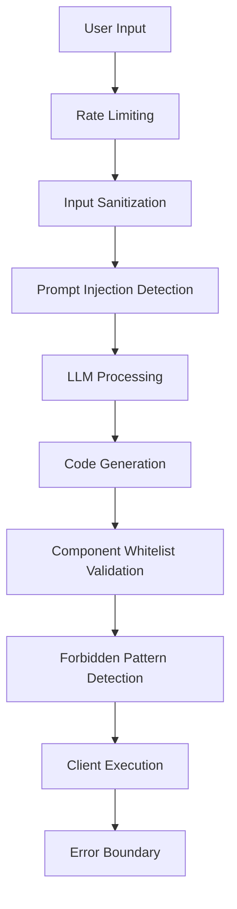
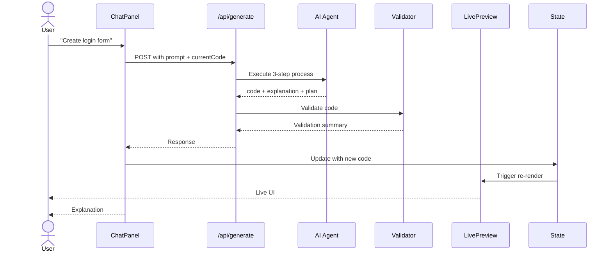
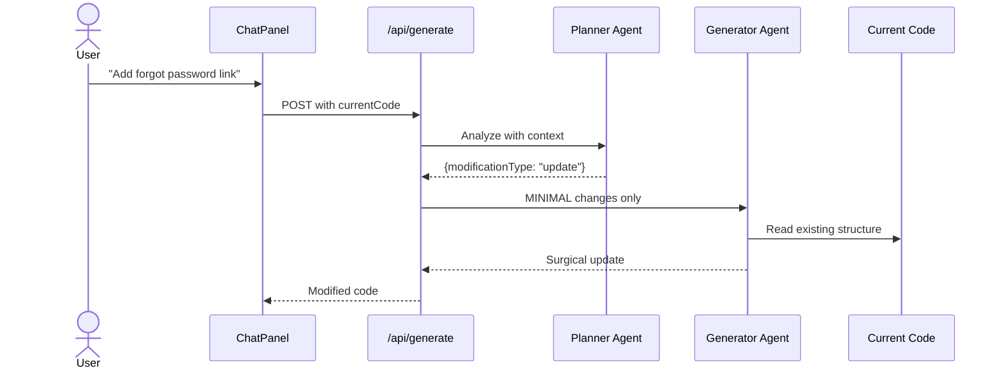
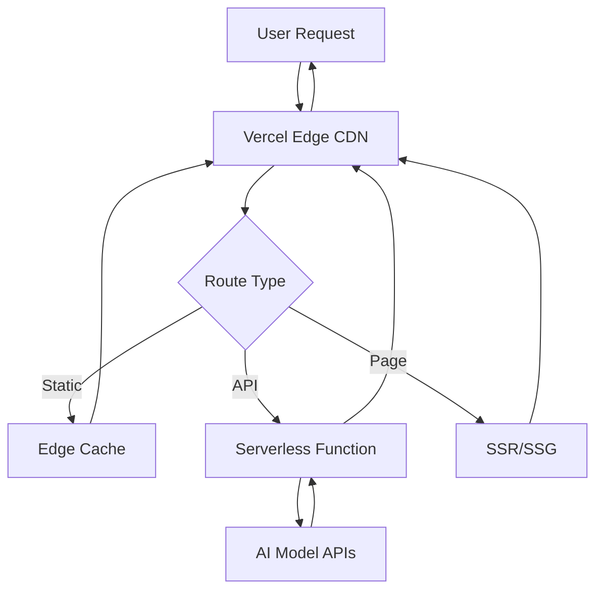

# Architecture Documentation  
## Ryze AI - Deterministic UI Generator

This document provides an in-depth technical overview of the system architecture, design decisions, and implementation details.

---

## Table of Contents

1. [System Overview](#system-overview)
2. [Agent Architecture](#agent-architecture)
3. [Component System](#component-system)
4. [Code Execution Engine](#code-execution-engine)
5. [Security Model](#security-model)
6. [Frontend Architecture](#frontend-architecture)
7. [Data Flow](#data-flow)
8. [Technical Decisions](#technical-decisions)
9. [Trade-offs](#trade-offs)

---

## System Overview

### High-Level Architecture

```mermaid
graph TB
    subgraph "Frontend - Next.js App Router"
        UI[Main Page Component]
        Chat[Chat Panel]
        Editor[Code Editor]
        Preview[Live Preview]
        Diff[Diff Viewer]
    end
    
    subgraph "Backend - API Routes"
        API[/api/generate]
        Val[Validation Layer]
        Sec[Security Layer]
    end
    
    subgraph "AI Agent System"
        Planner[Step 1: Planner]
        Generator[Step 2: Generator]
        Explainer[Step 3: Explainer]
    end
    
    subgraph "Component Library"
        Layouts[Layout Components]
        Forms[Form Components]
        Display[Display Components]
        Charts[Chart Components]
        Registry[Component Registry]
    end
    
    subgraph "External Services"
        Gemini[Google Gemini API]
        OpenAI[OpenAI API - Fallback]
    end
    
    UI --> Chat
    UI --> Editor
    UI --> Preview
    UI --> Diff
    
    Chat --> API
    API --> Sec
    Sec --> Val
    Val --> Planner
    Planner --> Gemini
    Planner --> OpenAI
    Generator --> Gemini
    Generator --> OpenAI
    Explainer --> Gemini
    Explainer --> OpenAI
    
    Planner --> Generator
    Generator --> Explainer
    Explainer --> Val
    Val --> API
    API --> Chat
    
    Preview --> Layouts
    Preview --> Forms
    Preview --> Display
    Preview --> Charts
    
    Registry -.Documents.-> Planner
    Registry -.Documents.-> Generator
```

### Tech Stack

| Layer | Technology | Rationale |
|-------|-----------|-----------|
| **Framework** | Next.js 16 (App Router) | Server-side rendering, API routes, optimal performance |
| **Language** | TypeScript | Type safety, better DX, catch errors at compile time |
| **Styling** | Tailwind CSS v4 | Utility-first, rapid prototyping, consistent design |
| **UI Components** | Custom Library | Full control, determinism, no external dependencies |
| **Code Editor** | Monaco Editor | Industry-standard, VS Code experience |
| **Code Execution** | Sucrase | Fast JSX/TS transpilation, client-side execution |
| **AI** | Google Gemini | Primary LLM, good balance of speed/quality |
| **Fallback AI** | OpenAI GPT | Backup for reliability |
| **State Management** | React useState | Simple, sufficient for single-page app |
| **Deployment** | Vercel | Native Next.js support, edge functions |

---

## Agent Architecture

### Design Philosophy

The agent follows a **deterministic, multi-step reasoning** approach inspired by chain-of-thought prompting and tool-using agents.

### Step 1: Planner 

**Purpose**: Analyze intent and create structured plan

**Input**:
- User's natural language request
- Current code context (for iterations)

**Process**:
```typescript
PLANNER_PROMPT = `
Instructions:
1. Determine if NEW or UPDATE
2. For UPDATE: Plan minimal changes
3. For NEW: Design complete structure
4. Select ONLY from allowed components
`
```

**Output** (JSON):
```json
{
  "modificationType": "new" | "update",
  "layout": "High-level layout description",
  "structure": [/*component tree*/],
  "reasoning": "Why this approach",
  "modifications": "What changes (if update)",
  "preserved": "What stays same (if update)"
}
```

**Key Innovation**: Explicit `modificationType` field forces the LLM to consciously decide between generation modes.

### Step 2: Generator

**Purpose**: Convert plan to valid React code

**Input**:
- Structured plan from Step 1
- Current code (for context)
- Modification type

**Process**:
```typescript
GENERATOR_PROMPT = `
IF modificationType is "update":
  - DO NOT REGENERATE!
  - Make MINIMAL changes
  - PRESERVE existing code
ELSE:
  - Generate from scratch
  
Constraints:
  - ONLY use component whitelist
  - NO HTML tags
  - NO custom CSS
`
```

**Output**: Valid TSX code in markdown code block

**Critical Features**:
- **Preservation Instructions**: Explicitly tells LLM what NOT to change
- **Component Enforcement**: Repeated warnings about whitelist
- **Example Imports**: Shows exact import syntax

### Step 3: Explainer

**Purpose**: Generate human-readable explanation

**Input**:
- Original user request
- Plan reasoning
- Modification type
- What changed/preserved

**Output**: Markdown-formatted explanation

**Format Template**:
```markdown
**Summary**: [One-line description]

**Design Decisions**:
- Layout choice reasoning
- Component selection reasoning
- How it meets intent

**Changes Made** (if update):
- What was added
- What was modified
- What was preserved
```

### Agent Orchestration

```typescript
// api/generate/route.ts
async function POST(req) {
  // Security first
  await rateLimit.check()
  sanitizeInput(userRequest)
  
  // Step 1: Plan
  const plan = await llm(PLANNER_PROMPT)
  
  // Step 2: Generate
  const code = await llm(GENERATOR_PROMPT
    .replace("{{modificationType}}", plan.modificationType))
  
  // Validate
  const validation = validateComponentUsage(code)
  
  // Step 3: Explain
  const explanation = await llm(EXPLAINER_PROMPT
    .replace("{{modifications}}", plan.modifications))
  
  return { code, explanation, validation }
}
```

---

## Component System

### Design Constraints

The entire system is built around a **fundamental constraint**: All UIs must use the exact same components every time.

**Why?**
- **Determinism**: Same input → Same output
- **Safety**: No arbitrary code generation
- **Debuggability**: Finite set of possible outputs
- **Consistency**: Visual consistency across generations

### Component Categories

```typescript
// src/components/ui-lib/registry.ts
const COMPONENTS = {
  layouts: ["Box", "Stack", "Grid", "Container"],
  typography: ["Heading", "Text"],
  forms: ["Button", "Input"],
  display: ["Card", "Table", "Modal"],
  navigation: ["Navbar", "Sidebar"],
  charts: ["BarChart", "LineChart", "PieChart"]
}
```

### Component Implementation Pattern

All components follow the same pattern:

```tsx
// Example: Button.tsx
import { cva, VariantProps } from "class-variance-authority"

const buttonStyles = cva("base-classes", {
  variants: {
    variant: { primary: "...", secondary: "..." },
    size: { sm: "...", md: "...", lg: "..." }
  },
  defaultVariants: { variant: "primary", size: "md" }
})

export function Button(props: VariantProps<typeof buttonStyles>) {
  return <button className={buttonStyles(props)} {...props} />
}
```

**Key Points**:
- **Class Variance Authority (CVA)**: Type-safe variant management
- **Tailwind Merge**: Prevents class conflicts
- **No Inline Styles**: All styling via predefined classes
- **Prop-based Configuration**: Variants, not arbitrary props

### Chart Components

Charts are implemented **without external libraries** to maintain the "no external UI dependencies" constraint:

```tsx
// BarChart - Pure SVG/CSS
export function BarChart({ data, title }) {
  const maxValue = Math.max(...data.map(d => d.value))
  
  return (
    <div className="chart-container">
      {data.map((item, i) => {
        const height = (item.value / maxValue) * 100
        return (
          <div 
            className="bar" 
            style={{ height: `${height}%` }} 
          />
        )
      })}
    </div>
  )
}
```

**Supported Charts**:
- **BarChart**: CSS-based vertical bars
- **LineChart**: SVG polyline with circles
- **PieChart**: SVG path-based pie slices

**Mocked Data**: All charts accept optional `data` prop; use sensible defaults if not provided.

---

## Code Execution Engine

### Live Preview Architecture

The Live Preview component uses a **client-side code execution** approach:



### Implementation

```typescript
// LivePreview.tsx
function LivePreview({ code }) {
  // 1. Strip imports (scope injection handles them)
  const noImports = code.replace(/import .* from .*/g, "")
  
  // 2. Transform TSX → JS
  const js = transform(noImports, {
    transforms: ["typescript", "jsx"]
  }).code
  
  // 3. Replace export with return
  const runnable = js.replace(/export default/, "return")
  
  // 4. Create scope
  const scope = {
    React,
    Button, Card, /* all components */,
    ...LucideIcons
  }
  
  // 5. Execute in controlled scope
  const fn = new Function(...Object.keys(scope), runnable)
  const Component = fn(...Object.values(scope))
  
  // 6. Render
  return <ErrorBoundary><Component /></ErrorBoundary>
}
```

### Security Considerations

**Why is this safe?**
1. **Scope Injection**: Only allowed components in scope
2. **No External Network**: `fetch`, `XMLHttpRequest` not in scope
3. **Validation First**: Code validated before execution
4. **Error Boundaries**: Catch runtime errors
5. **Client-Side Only**: No server access

**What could still go wrong?**
- Infinite loops (mitigated by React timeout)
- Memory leaks (user refresh solves it)
- LocalStorage access (acceptable risk for prototype)

---

## Security Model

### Defense Layers



### 1. Rate Limiting

```typescript
// lib/security.ts
class RateLimiter {
  private requests = new Map<string, number[]>()
  
  check(ip: string): boolean {
    const now = Date.now()
    const recent = this.requests.get(ip) || []
    const valid = recent.filter(t => now - t < 60000) // 1min window
    
    if (valid.length >= 20) return false // Max 20/min
    
    valid.push(now)
    this.requests.set(ip, valid)
    return true
  }
}
```

**Limitations**: In-memory (resets on deploy). Production would use Redis.

### 2. Input Sanitization

```typescript
// lib/validation.ts
function sanitizeUserInput(input: string): string {
  let clean = input
    .replace(/<script.*?<\/script>/gi, "") // Remove scripts
    .replace(/javascript:/gi, "") // Remove JS protocol
    .substring(0, 10000) // Limit length
  return clean
}
```

### 3. Prompt Injection Detection

```typescript
const SUSPICIOUS_PATTERNS = [
  /ignore (previous|above) instructions/gi,
  /you are now/gi,
  /system:/gi,
  /forget everything/gi
]

function detectPromptInjection(input: string): boolean {
  return SUSPICIOUS_PATTERNS.some(p => p.test(input))
}
```

**Action**: Log warning, continue processing (don't block legitimate use)

### 4. Component Whitelist

```typescript
function validateComponentUsage(code: string): ValidationResult {
  const used = extractComponents(code)
  const unknown = used.filter(c => !ALLOWED.includes(c))
  
  return {
    isValid: unknown.length === 0,
    warnings: unknown.map(c => `Unknown component: ${c}`)
  }
}
```

### 5. Forbidden Pattern Detection

```typescript
const DANGEROUS = [
  /eval\(/gi,
  /Function\(/gi,
  /dangerouslySetInnerHTML/gi,
  /<script>/gi
]
```

---

## Frontend Architecture

### State Management

**Decision**: Use React's built-in `useState` instead of Redux/Zustand

**Why?**
- Single-page app, simple state
- No cross-component state sharing needed
- Performance is not bottleneck
- Simpler codebase

### State Structure

```typescript
// page.tsx
const [code, setCode] = useState<string>("")
const [history, setHistory] = useState<string[]>([])
const [historyIndex, setHistoryIndex] = useState(-1)
const [activeTab, setActiveTab] = useState<"preview" | "code" | "diff">("preview")
```

### History Management

```typescript
function handleCodeUpdate(newCode: string) {
  // Truncate future if we're in the middle of history
  const newHistory = history.slice(0, historyIndex + 1)
  
  // Add new code
  newHistory.push(newCode)
  
  // Update state
  setHistory(newHistory)
  setHistoryIndex(newHistory.length - 1)
  setCode(newCode)
}
```

**Undo/Redo**:
- Undo: `historyIndex--`
- Redo: `historyIndex++`
- Jump to: `setHistoryIndex(n)`

---

## Data Flow

### UI Generation Flow



### Iteration Flow



**Critical**: `currentCode` prop must be passed to API for this to work!

---

## Technical Decisions

### Why Next.js App Router?

**Pros**:
- Server components for better performance
- Built-in API routes
- File-based routing
- Automatic code splitting
- Vercel optimization

**Cons**:
- Learning curve for new paradigm
- Some libraries not compatible yet

**Decision**: Pros outweigh cons for this use case.

### Why Client-Side Code Execution?

**Alternative**: Send code to server, execute in sandbox, return HTML

**Chosen**: Client-side with `new Function()`

**Rationale**:
- Instant feedback (no network round-trip)
- Scales better (no server CPU usage)
- Simpler architecture
- Safe with proper scope injection

**Risks Accepted**:
- Client can see/modify code (acceptable for this use case)
- Browser compatibility required

### Why Sucrase Over Babel?

**Performance**:
- Sucrase: ~20x faster than Babel
- We only need JSX/TS transform, not polyfills
- Client-side, every millisecond matters

**Trade-off**: Less configurability, but we don't need it.

### Why Monaco Editor?

**Alternatives**: CodeMirror, Ace Editor, Textarea

**Chosen**: Monaco

**Rationale**:
- Industry standard (VS Code)
- Best TypeScript support
- Syntax highlighting
- Autocomplete potential
- Familiar UX

**Downside**: Large bundle size (~1.2 MB)

**Mitigation**: Dynamic import, code splitting

---

## Trade-offs

### 1. In-Memory History vs Persistent Storage

**Current**: `useState` + array

**Alternative**: LocalStorage, IndexedDB, Database

**Why Current**:
- Simpler implementation
- No serialization complexity
- Fresh start each session prevents clutter

**Accepted Limitation**: History lost on refresh

**If More Time**: Add localStorage with clear button

### 2. Simple Diff vs Advanced Algorithm

**Current**: Line-by-line comparison

**Alternative**: `diff-match-patch`, `fast-diff`

**Why Current**:
- No extra dependencies
- Good enough for most cases
- Instant computation

**Limitation**: Doesn't handle moved lines well

**If More Time**: Use `diff-match-patch` for better accuracy

### 3. No Streaming vs Server-Sent Events

**Current**: Wait for complete response

**Alternative**: Stream tokens as they generate

**Why Current**:
- Simpler implementation
- JSON parsing easier with complete response
- Step separation (plan → code → explanation)

**Limitation**: Feels slower for long responses

**If More Time**: Implement SSE for explanation step

### 4. Basic Rate Limiting vs Production Solution

**Current**: In-memory Map

**Alternative**: Redis, Upstash, Vercel KV

**Why Current**:
- No external dependency
- Sufficient for demo/assignment
- Resets on deploy (acceptable)

**Limitation**: Not persistent, not distributed

**Production**: Use Redis with distributed keys

---

## Performance Considerations

### Bundle Size

| Resource | Size | Optimization |
|----------|------|--------------|
| Monaco Editor | ~1.2 MB | Dynamic import, lazy load |
| Sucrase | ~200 KB | Essential, no alternative |
| Lucide Icons | ~150 KB | Tree-shakeable, only used icons |
| Component Library | ~50 KB | Custom, minimal |

### Rendering Performance

- **React 19**: Latest concurrent features
- **Error Boundaries**: Prevent cascade failures
- **Memo**: Used selectively for expensive renders
- **Virtual DOM**: React handles efficiently

### LLM Performance

- **Gemini 2.0 Flash**: ~2-3s per step
- **3 Steps**: ~6-9s total for generation
- **Fallback**: OpenAI if Gemini fails
- **Future**: Cache plans, parallel steps where possible

---

## Deployment Architecture

### Vercel Edge Network



### Environment Variables

```bash
# Production
GEMINI_API_KEY=AIza...
OPENAI_API_KEY=sk-proj-... # Optional fallback

# Development
# Can also paste in UI
```

### Scaling Considerations

**Current Bottleneck**: AI API rate limits

**Future**:
- Add caching layer for common requests
- Queue system for high load
- Multiple API keys rotation

---

## Conclusion

This architecture prioritizes:
1. **Determinism**: Same input → Same output
2. **Safety**: Multiple validation layers
3. **Simplicity**: Minimal dependencies
4. **User Experience**: Fast, intuitive, debuggable
5. **Maintainability**: Clear separation of concerns

The trade-offs made are appropriate for a **prototype/assignment** context while maintaining production-ready code quality where it matters (security, validation, core logic).
