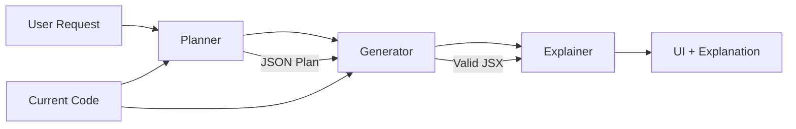
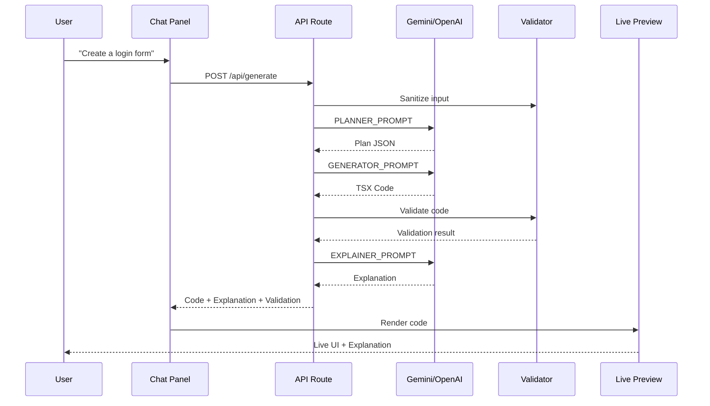

# Ryze AI - Deterministic UI Generator

An AI-powered agent that converts natural language UI intent into working React code using a fixed, deterministic component library. Think Claude Code for UI — but safe, reproducible, and debuggable.


## 🎯 Demo

**Deployed URL**: [Your Vercel URL here]

## ✨ Features

- **Natural Language to UI**: Describe your UI in plain English, get working code instantly
- **Deterministic Component System**: Uses a strictly defined set of components to ensure 100% visual consistency
- **Iterative Editing**: Refine your UI iteratively (e.g., "Add a forgot password link", "Make the chart bigger")
- **Live Preview**: Instantly see the rendered UI with hot-reload support
- **Code Editor**: Inspect and manually edit the generated JSX with Monaco Editor
- **Diff Viewer**: See exactly what changed between versions with side-by-side comparison
- **Version History**: Full undo/redo support to navigate between generations
- **Explainability**: AI explains every design decision in plain English
- **Safety First**: Component whitelist enforcement, prompt injection detection, rate limiting

## 🚀 Quick Start

### Prerequisites
- Node.js 18+ 
- npm or yarn
- Google Gemini API Key (or OpenAI API Key)

### Installation

```bash
# Clone the repository
git clone https://github.com/rahull2509/Deterministic-UI-Generator.git

# Install dependencies
npm install

# Set up environment variables
cp .env.example .env.local
# Edit .env.local and add your GEMINI_API_KEY

# Run development server
npm run dev

# Open http://localhost:3000
```

### API Key Setup

You have two options to provide the API key:

1. **Environment Variable** (Recommended for deployment):
   - Set `GEMINI_API_KEY` in `.env.local` or Vercel environment variables

2. **UI Input** (Recommended for testing):
   - Click "Settings" in the app
   - Paste your API key when prompted

## 🏗️ Architecture

### Agent Design (3-Step Process)

The system implements a deterministic, multi-step AI agent:



#### 1️⃣ **Planner**
- **Input**: User request + current code context
- **Process**: 
  - Detects if this is a NEW generation or UPDATE
  - For updates: Plans minimal, surgical changes
  - For new: Designs complete UI structure
- **Output**: Structured JSON plan with:
  - `modificationType`: "new" or "update"
  - `structure`: Component tree
  - `reasoning`: Why this approach
  - `modifications`: What will change (for updates)
  - `preserved`: What will stay the same (for updates)

#### 2️⃣ **Generator**
- **Input**: Structured plan + current code
- **Process**:
  - For NEW: Generates complete component from scratch
  - For UPDATE: Makes targeted changes, preserves everything else
  - Strict component whitelist enforcement
- **Output**: Valid React TSX code using only allowed components
- **Critical Rules**:
  - ❌ NO custom components
  - ❌ NO arbitrary CSS/Tailwind
  - ❌ NO HTML tags (div, span, etc.) - use component library equivalents
  - ✅ ONLY use predefined component library

#### 3️⃣ **Explainer**
- **Input**: User request + plan reasoning
- **Output**: Markdown explanation covering:
  - Why specific layout was chosen
  - Why specific components were selected
  - How it meets user's intent
  - What changed vs preserved (for updates)

### System Flow



## 📦 Component Library

### Fixed Component Set

All UIs must use these components exclusively:

| Category | Components |
|----------|-----------|
| **Layouts** | Box, Stack, Grid, Container |
| **Typography** | Heading, Text |
| **Forms** | Button, Input |
| **Data Display** | Card, Table |
| **Navigation** | Navbar, Sidebar, Modal |
| **Charts** | BarChart, LineChart, PieChart |

### Design Philosophy

1. **Determinism**: Components never change implementation
2. **Composability**: Complex UIs from simple primitives
3. **Constraints**: No inline styles, no custom CSS, no new components
4. **Safety**: Whitelist enforcement prevents arbitrary code

### Example Component Usage

```tsx
import { Stack, Card, CardTitle, CardContent } from "@/components/ui-lib"
import { Button } from "@/components/ui-lib/Button"
import { BarChart } from "@/components/ui-lib/Chart"

export default function GeneratedUI() {
  return (
    <Stack direction="column" gap="lg">
      <Card>
        <CardTitle>Dashboard</CardTitle>
        <CardContent>
          <BarChart 
            title="Monthly Sales"
            data={[
              { label: "Jan", value: 65 },
              { label: "Feb", value: 80 }
            ]}
          />
        </CardContent>
      </Card>
      <Button variant="primary">View Details</Button>
    </Stack>
  )
}
```

## 🔒 Safety & Validation

### Component Whitelist Enforcement
- Validates generated code against allowed components
- Detects and warns about forbidden HTML tags
- Prevents arbitrary component creation

### Prompt Injection Protection
- Detects suspicious patterns in user input
- Sanitizes input to prevent XSS
- Logs potential injection attempts

### Rate Limiting
- 20 requests per minute per IP (in-memory)
- Prevents API abuse
- Configurable limits

### Code Validation
- Checks for dangerous patterns (eval, dangerouslySetInnerHTML)
- Validates import statements
- Provides user-friendly validation summaries

## 🎨 UI Features

### Three-Panel Interface

1. **Left: AI Chat**
   - Natural language input
   - Conversation history
   - AI explanations with markdown rendering
   - Validation warnings/errors

2. **Right Top: View Tabs**
   - **Preview**: Live rendered UI
   - **Code**: Monaco editor with syntax highlighting
   - **Diff**: Side-by-side comparison of changes

3. **Right Bottom: Generated UI**
   - Real-time updates
   - Error boundaries for safety
   - Component validation display

### Iteration & Edit Awareness

The system excels at iterative refinement:

```
User: "Create a login form"
→ Generates complete form with email, password, button

User: "Add a forgot password link"
→ Only adds link, preserves existing form

User: "Make it more minimal"
→ Adjusts styling, keeps all functionality
```

**NOT** a full rewrite every time - makes surgical changes.

## 🧪 Testing

### Manual Test Scenarios

Run the application and test these scenarios:

#### Test 1: Initial Generation
```
"Create a dashboard with sidebar and cards showing stats"
✓ Should use Sidebar, Card, Grid components
✓ Preview shows working UI
✓ Explanation appears in chat
```

#### Test 2: Iterative Modification
```
First: "Create a login form"
Then: "Add a remember me checkbox"
✓ Preserves existing email/password fields
✓ Diff tab shows only new checkbox lines
✓ Explanation mentions what was preserved
```

#### Test 3: Complex UI
```
"E-commerce product page with image, details, and chart"
✓ Uses Card, Grid, BarChart
✓ No forbidden HTML tags
✓ Renders correctly in preview
```

#### Test 4: Version History
```
Generate 3 different UIs
Click Undo 2 times
Click Redo 1 time
✓ UI updates correctly
✓ Code matches preview
```

## 🚢 Deployment

### Vercel (Recommended)

```bash
# 1. Push to GitHub
git add .
git commit -m "Ready for deployment"
git push origin main

# 2. Import to Vercel
# Go to vercel.com/new
# Import your repository

# 3. Set Environment Variables
# Add GEMINI_API_KEY in Vercel project settings

# 4. Deploy
# Vercel auto-deploys on push
```

### Environment Variables

| Variable | Required | Description |
|----------|----------|-------------|
| `GEMINI_API_KEY` | Optional* | Google Gemini API key |
| `OPENAI_API_KEY` | Optional* | OpenAI API key (fallback) |

*At least one LLM API key is required (can be provided via UI)

## 📁 Project Structure

```
ryze-app/
├── src/
│   ├── app/
│   │   ├── page.tsx              # Main UI orchestrator
│   │   ├── api/generate/route.ts # Agent API endpoint
│   │   └── globals.css           # Global styles
│   ├── components/
│   │   ├── ui-lib/               # Fixed component library
│   │   │   ├── Button.tsx
│   │   │   ├── Card.tsx
│   │   │   ├── Input.tsx
│   │   │   ├── Layouts.tsx
│   │   │   ├── Chart.tsx         # BarChart, LineChart, PieChart
│   │   │   ├── ...
│   │   │   └── registry.ts       # Component documentation
│   │   └── agent-ui/             # Agent interface components
│   │       ├── ChatPanel.tsx     # AI chat interface
│   │       ├── CodeEditor.tsx    # Monaco editor
│   │       ├── LivePreview.tsx   # Runtime code execution
│   │       └── DiffViewer.tsx    # Version comparison
│   └── lib/
│       ├── agent/prompts.ts      # The 3 agent prompts
│       ├── llm.ts                # LLM API client
│       ├── validation.ts         # Code validation
│       ├── security.ts           # Rate limiting, sanitization
│       └── utils.ts              # Utilities
├── public/                       # Static assets
├── README.md                     # This file
├── ARCHITECTURE.md               # Detailed technical docs
└── DEPLOY.md                     # Deployment guide
```

## 🐛 Known Limitations

### Current Limitations
- **No Authentication**: Single-user, client-side only (as per requirements)
- **In-Memory History**: Lost on page refresh (could add localStorage)
- **Basic Diff**: Line-by-line comparison (could use advanced diff algorithm)
- **Limited Charts**: Only Bar/Line/Pie with simple data (no interactive charts)
- **No Streaming**: Full response wait (could add streaming for better UX)

### Edge Cases
- Very complex state management in generated components may not work perfectly
- Icons must be from Lucide React (limited icon set)
- Browser compatibility: Modern browsers only (uses ES6+ features)

## 🚀 What I'd Improve with More Time

### High Priority
1. **Streaming Responses**: Token-by-token streaming for better perceived performance
2. **localStorage Persistence**: Save history across page refreshes
3. **Advanced Diff Algorithm**: Use diff-match-patch for intelligent change detection
4. **More Components**: DatePicker, Select, Tabs, Accordion, Toast
5. **Theme System**: Dark mode, color customization

### Medium Priority
6. **Visual Component Palette**: Drag-and-drop alongside chat
7. **Export Functionality**: Download as standalone React component
8. **Component Props Inspector**: Visual prop editor
9. **Accessibility Audit**: ARIA labels, keyboard navigation
10. **Test Suite**: Unit tests, integration tests, E2E with Playwright

### Nice to Have
11. **Multi-Model Support**: Switch between GPT-4, Claude, Gemini
12. **Collaborative Editing**: Real-time multi-user support
13. **Analytics Dashboard**: Track usage, popular patterns
14. **Component Playground**: Isolated component testing
15. **AI Model Fine-tuning**: Train on successful generations

## 📚 Additional Documentation

- **[ARCHITECTURE.md](./ARCHITECTURE.md)**: In-depth technical architecture
- **[DEPLOY.md](./DEPLOY.md)**: Step-by-step deployment guide
- **[API.md](./docs/API.md)**: API documentation (if applicable)

## 🤝 Contributing

This is a take-home assignment project. For production use:
1. Fork the repository
2. Create a feature branch
3. Make your changes
4. Submit a pull request

## 📄 License

MIT License - feel free to use this project as a starting point for your own UI generator!

## 🙏 Acknowledgments

- Built for Ryze AI Full-Stack Assignment
- Powered by Google Gemini and OpenAI
- UI inspired by Claude Code, Cursor, and Vercel v0

---

**Made with ❤️ for Ryze AI**

*For questions or issues, contact: [your-email@example.com]*
